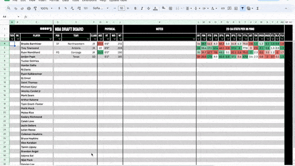

# NBADraftProspectStatCollector
A Google Apps Script program that populates a Google Sheet with up-to-date NBA Draft Prospect Data by web scraping RealGM

## Features:
- collects jersey number, class, height, and weight from RealGM's player database
- calculates age using birthdate
- converts traditional per game statistics to per 36 minutes statistics and color codes them in comparison to the rest of the players
- allows you to reassign and keep the position you feel is most accurate for the player
 
## Setup:
1) make a copy of the linked formatted sheet
2) select extensions in the menu above the sheet
3) select Apps Script
4) upload the code.js file
5) run it

## The Process:
1) write the players' names in the C column and links to the players' RealGM profile page in the AB column
2) update the starting row function (necessary if there are too many rows to run before encountering exceeding time limit)
3) run the "Update Table" function that is created when the script is ran for the first time

